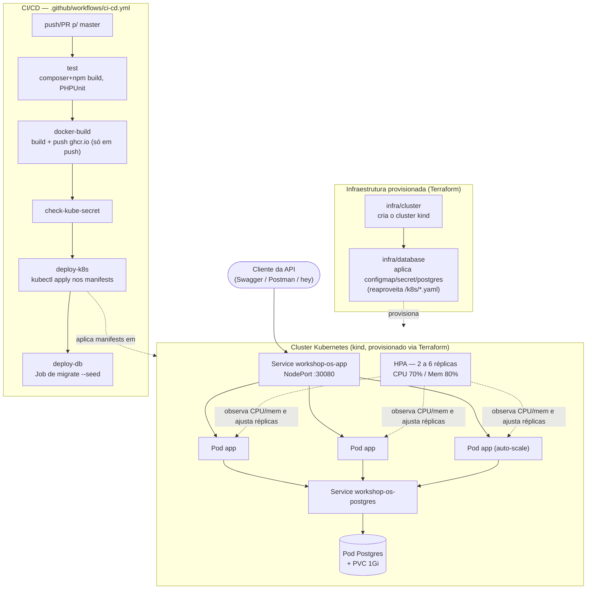

# 15SOAT - Fase 1/2 - Tech Challenge

API RESTful para gestão de ordens de serviço (OS) de uma oficina mecânica.

---

## Stack

| Camada       | Tecnologia                        |
|--------------|-----------------------------------|
| Linguagem    | PHP `^8.3` (imagem Docker/CI usa 8.4) |
| Framework    | Laravel 13                        |
| Banco        | PostgreSQL 16 (produção/Docker/K8s) |
| Banco testes | SQLite `:memory:`                 |
| Auth         | Laravel Sanctum (API tokens)      |
| Docs         | L5-Swagger / OpenAPI 3            |
| Fila         | Database driver                   |
| Container    | Docker (multi-stage)              |
| Orquestração | Kubernetes (`/k8s`)               |
| IaC          | Terraform (`/infra`)              |
| CI/CD        | GitHub Actions (`.github/workflows/ci-cd.yml`) |

---

## Fase 2 — objetivo desta evolução

A Fase 1 entregou o sistema inicial de gestão de OS, veículos, clientes e
estoque. A Fase 2 evolui essa aplicação para suportar crescimento — mais
unidades, mais volume de OS em horários de pico — sem perder qualidade:

- Refatoração para **Arquitetura Hexagonal leve** (`Domain` → `Application`
  → `Infrastructure`/`Http`), preservando as regras de negócio da Fase 1.
- Novas/alteradas APIs de OS: abertura com serviços/itens no mesmo payload,
  consulta rápida de status, aprovação de orçamento via webhook, listagem
  ordenada por prioridade de status, atualização de status via e-mail
  (stub).
- **Containerização, Kubernetes, Terraform e CI/CD** para suportar
  escalabilidade dinâmica e deploy automatizado.

### Componentes da aplicação

```
app/
├── Domain/
│   └── ServiceOrder/
├── Application/
│   ├── ServiceOrder/
│   └── Ports/
├── Infrastructure/
│   ├── Persistence/Eloquent/
│   └── Messaging/
├── Contracts/
├── Enums/ 
├── Http/
│   ├── Controllers/Api/V1/
│   ├── Middleware/
│   ├── Requests/
│   └── Resources/
├── Jobs/
├── Models/
├── Providers/ 
└── Services/
```

Regra de dependência: `Domain` não conhece Laravel/Eloquent; `Application`
orquestra casos de uso sobre `Domain` + `Ports`; `Infrastructure`/`Http`
implementam esses Ports e adaptam para fora (HTTP, banco). Integrações
externas (pagamento e mensageria) são **stubs** — contratos definidos via
interface, prontos para substituição por implementações reais.

### Infraestrutura provisionada

| Camada       | Onde                | O quê |
|--------------|---------------------|-------|
| Container    | `Dockerfile`         | Build multi-stage: `deps` (composer) → `frontend` (npm/vite) → `runtime` (imagem final enxuta) |
| Orquestração | `k8s/`               | Deployment + Service + ConfigMap + Secret + HPA da API, Deployment + Service + PVC do Postgres, Job de migração |
| IaC          | `infra/`             | Terraform: `infra/cluster` provisiona o cluster kind local; `infra/database` aplica os manifestos de banco/config reaproveitando os arquivos de `k8s/` |
| CI/CD        | `.github/workflows/` | Pipeline de build, testes, build+push da imagem e deploy no cluster |

### Desenho da arquitetura



Fluxo resumido: `push/PR → build (composer+npm) → test (PHPUnit, SQLite :memory:) → docker-build (build + push da imagem para ghcr.io, só em push p/ master) → deploy-k8s (kubectl apply: configmap, secret, postgres, deployment, service, hpa) → deploy-db (Job de migração + seed)`.

`deploy-k8s`/`deploy-db` só rodam com o secret `KUBE_CONFIG` configurado no repositório (cluster real e alcançável); sem isso, ficam `skipped` — o cluster kind local (seção seguinte) é o alvo de deploy usado nesta fase, cloud é próximo passo (ver `infra/README.md`).

Detalhes de cada estágio em [`.github/workflows/ci-cd.yml`](.github/workflows/ci-cd.yml).

---

## Como rodar

### Execução local (Docker Compose)

> Necessário ter o Docker instalado na máquina.

```bash
docker compose up --build -d
```

O container sobe o banco, roda as migrations, popula os dados de demonstração e inicia o servidor.

| Recurso    | URL                                       |
|------------|-------------------------------------------|
| API        | http://localhost:8000/api/v1/             |
| Swagger UI | http://localhost:8000/api/documentation   |

### Deploy em Kubernetes

> Necessário ter Docker, [kind](https://kind.sigs.k8s.io/) e `kubectl`
> instalados. Provisione o cluster primeiro com Terraform (próxima seção)
> ou com `kind create cluster`.

```bash
# build local da imagem usada pelos manifests
docker build -t workshop-os-app:latest .
kind load docker-image workshop-os-app:latest --name workshop-os

# aplica config, secret, banco e a API
kubectl apply -f k8s/configmap.yaml -f k8s/secret.yaml -f k8s/postgres.yaml \
               -f k8s/deployment.yaml -f k8s/service.yaml -f k8s/hpa.yaml

# roda a migração/seed uma única vez
kubectl apply -f k8s/migrate-job.yaml
kubectl wait --for=condition=complete job/workshop-os-migrate --timeout=180s

# acesso local — funciona sempre:
kubectl port-forward svc/workshop-os-app 8000:8000
# alternativa, só se o cluster foi criado via infra/cluster (Terraform):
# http://localhost:30080 já é mapeado para o NodePort da API (ver k8s/service.yaml)
```

Detalhes de cada manifesto em [`k8s/`](k8s/). O HPA (`k8s/hpa.yaml`) requer
o [metrics-server](https://github.com/kubernetes-sigs/metrics-server)
instalado no cluster (não vem por padrão no kind).

### Provisionamento da infraestrutura com Terraform

> Necessário ter Docker e Terraform `>= 1.5` instalados.

```bash
cd infra/cluster && terraform init && terraform apply   # cria o cluster kind
cd ../database   && terraform init && terraform apply   # aplica config/secret/postgres no cluster
```

Recursos criados por cada módulo, ordem de `destroy` e pré-requisitos em
[`infra/README.md`](infra/README.md).

---

## Testar a API

- **Postman**: importe [`Tech_Challenge.postman_collection.json`](Tech_Challenge.postman_collection.json)
  — inclui as APIs alteradas/criadas na Fase 2 (consulta de status, decisão
  de orçamento via webhook, abertura de OS com serviços/itens no payload).
- **Swagger/OpenAPI**: com a aplicação rodando, acesse
  **http://localhost:8000/api/documentation**.

---

## Credenciais de demo

| Perfil        | E-mail                | Senha    | Pode fazer                                                               |
|---------------|-----------------------|----------|--------------------------------------------------------------------------|
| Recepcionista | recepcao@workshop.com | password | CRUD clientes/veículos, criar OS, entregar veículo após pagamento        |
| Mecânico      | mecanico@workshop.com | password | CRUD serviços/itens (estoque), criar OS, diagnóstico, execução, orçamento|
| Cliente       | carlos@example.com    | password | Consultar suas OSs, aprovar/cancelar orçamento, pagar OS                 |

---

## Fluxo de status da OS

```
received → in_diagnosis → awaiting_approval → approved → in_execution → finalized → delivered
                                           └→ cancelled
```

Notificações automáticas são disparadas na criação e nas transições de orçamento gerado, finalização e atraso na retirada (job horário).

---

## Endpoints principais

Todos os endpoints (exceto login) requerem o header:

```
Authorization: Bearer {token}
```

| Método | Rota                                          | Perfil                  | Descrição                                       |
|--------|-----------------------------------------------|-------------------------|-------------------------------------------------|
| POST   | `/api/v1/auth/login`                          | público                 | Login — retorna token Sanctum                   |
| POST   | `/api/v1/auth/logout`                         | autenticado             | Logout                                          |
| GET    | `/api/v1/auth/me`                             | autenticado             | Dados do usuário autenticado                    |
| GET    | `/api/v1/clients`                             | recepcionista/mecânico  | Listar clientes                                 |
| POST   | `/api/v1/clients`                             | recepcionista/mecânico  | Cadastrar cliente                               |
| GET    | `/api/v1/vehicles`                            | recepcionista/mecânico  | Listar veículos                                 |
| GET    | `/api/v1/services`                            | recepcionista/mecânico  | Listar serviços do catálogo (com itens)         |
| POST   | `/api/v1/services`                            | recepcionista/mecânico  | Cadastrar serviço (com lista de itens)          |
| GET    | `/api/v1/items`                               | recepcionista/mecânico  | Listar itens em estoque                         |
| POST   | `/api/v1/items`                               | recepcionista/mecânico  | Cadastrar item (`type`: `insumo` ou `peca`)     |
| PUT    | `/api/v1/items/{id}`                          | recepcionista/mecânico  | Atualizar item / ajustar estoque                |
| GET    | `/api/v1/service-orders`                      | todos                   | Listar OS — exclui finalizadas/entregues e ordena por prioridade de status (sem filtro `status`) |
| POST   | `/api/v1/service-orders`                      | recepcionista/mecânico  | Criar OS (aceita `services[]`/`items[]` já no payload) |
| GET    | `/api/v1/service-orders/{id}/status`          | todos                   | Consulta rápida da situação atual da OS         |
| POST   | `/api/v1/service-orders/{id}/services`        | mecânico                | Adicionar serviço (cria itens automaticamente)  |
| POST   | `/api/v1/service-orders/{id}/items`           | mecânico                | Adicionar item manualmente à OS                 |
| DELETE | `/api/v1/service-orders/{id}/items/{itemId}`  | mecânico                | Remover item da OS                              |
| POST   | `/api/v1/service-orders/{id}/generate-budget` | mecânico                | Gerar orçamento                                 |
| POST   | `/api/v1/service-orders/{id}/approve`         | cliente                 | Aprovar orçamento                               |
| POST   | `/api/v1/service-orders/{id}/cancel`          | cliente                 | Cancelar orçamento                              |
| POST   | `/api/v1/service-orders/{id}/pay`             | cliente                 | Pagar OS                                        |
| POST   | `/api/v1/service-orders/{id}/deliver`         | recepcionista           | Entregar veículo                                |
| POST   | `/webhook/messaging`                          | público                 | Sem corpo: lista OS abertas. Com `event`=`budget_approved`/`budget_rejected` + `order_number`: aplica a decisão do cliente |

Documentação completa e interativa em **http://localhost:8000/api/documentation**.

---

## Gestão de Itens na OS

Ao adicionar um serviço à OS, os itens necessários para executá-lo são criados automaticamente na lista de materiais da OS. O mecânico pode adicionar ou remover itens manualmente.

A resposta da OS inclui, para cada item:

| Campo               | Descrição                                  |
|---------------------|--------------------------------------------|
| `requested_quantity`| Quantidade necessária para a OS            |
| `total_quantity`    | Quantidade disponível em estoque           |

Isso permite ao frontend alertar o mecânico caso o estoque seja insuficiente antes de iniciar a execução.

---

## Testes

Rodar todos os testes:

```bash
composer run test
```

Rodar com relatório de cobertura no terminal + arquivos para o SonarQube:

```bash
XDEBUG_MODE=coverage php artisan test --coverage --coverage-clover=coverage.xml --log-junit=test-results.xml
```

**Resultado atual: 131 testes, 286 assertions.**

---

## SonarQube

Sobe o SonarQube (consome ~2 GB de RAM):

```bash
docker compose --profile sonar up -d
```

Acesse em **http://localhost:9000** (login: `admin`).

Gere o `coverage.xml` e rode o scanner:

```bash
XDEBUG_MODE=coverage php artisan test --coverage-clover=coverage.xml --log-junit=test-results.xml

export SONAR_TOKEN=<seu_token>
docker compose --profile sonar run sonarscanner
```
