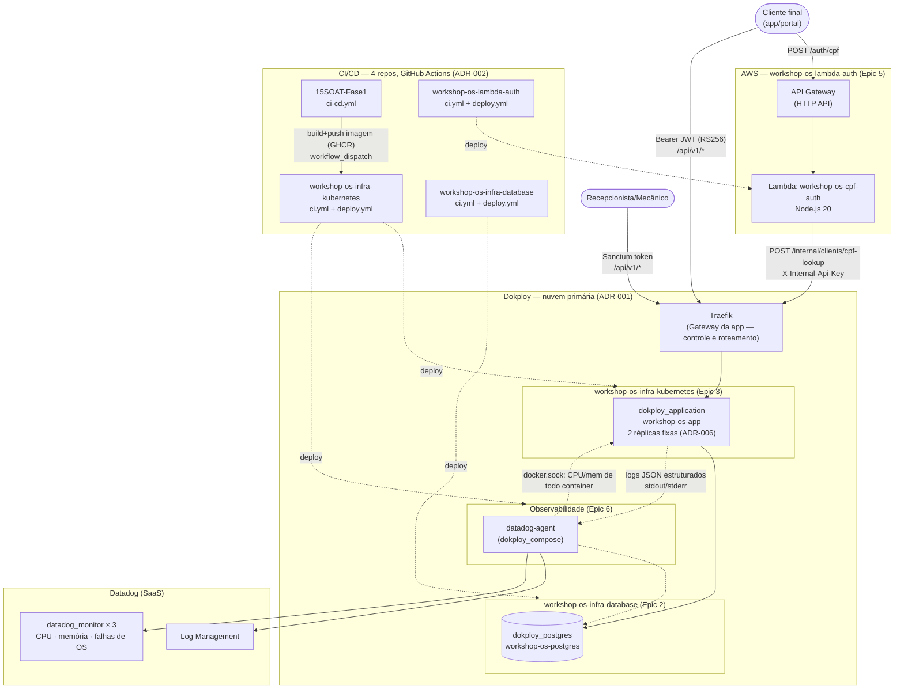

# Diagrama de componentes — Fase 3 (visão cloud-wide)

Visão consolidada dos 4 repositórios, nuvens envolvidas, APIs, banco e
monitoramento. Decisões referenciadas: todas as RFCs/ADRs em
[`../rfcs/`](../rfcs/) e [`../adrs/`](../adrs/).

## Legenda de status (nesta sessão de desenvolvimento)

| Componente | Código/Terraform | `terraform validate` / testes | `apply` real |
|---|---|---|---|
| App principal | ✅ | ✅ 150 testes PHPUnit | ⏳ requer Dokploy real |
| Banco (Epic 2) | ✅ | ✅ contra `vanillauys/dokploy` | ⏳ |
| App/domínio (Epic 3) | ✅ | ✅ | ⏳ |
| Lambda (Epic 5) | ✅ | ✅ 19 testes `node:test` | ⏳ requer conta AWS |
| Datadog (Epic 6) | ✅ (escopo documentado em ADR-009) | ✅ contra `DataDog/datadog` | ⏳ requer conta Datadog conectada |

Nenhum `terraform apply`/deploy real foi executado nesta sessão — todas as
credenciais de nuvem (Dokploy, AWS, Datadog) pertencem ao usuário e não
foram compartilhadas na conversa, corretamente. "Links para os deploys
ativos" (pedido em `evolucao_fase3`) ficam pendentes até a aplicação real
acontecer — não fabricados aqui.
