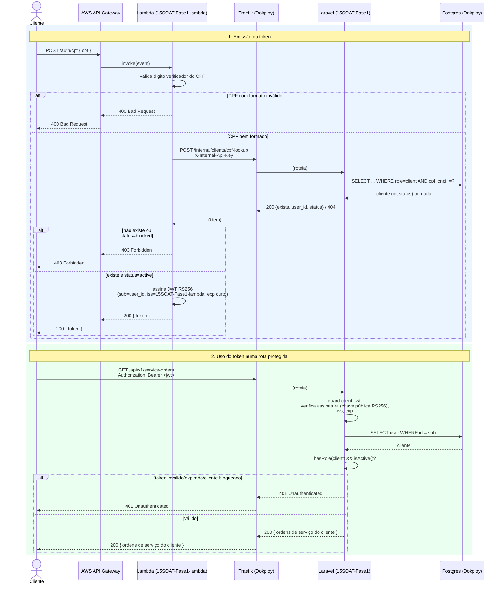

# Diagrama de sequência — autenticação por CPF (Fase 3)

Fluxo completo: emissão do token (Lambda) + uso do token numa rota protegida
da aplicação principal. Decisões referenciadas:
[RFC-003](../rfcs/rfc-003-cpf-auth-strategy.md),
[ADR-007](../adrs/adr-007-aws-api-gateway.md),
[ADR-008](../adrs/adr-008-jwt-validation-layer.md).

Notas:
- O Lambda nunca acessa o Postgres diretamente — só via
  `POST /internal/clients/cpf-lookup`, decisão de segurança do RFC-003.
- A validação do JWT acontece na aplicação (guard `client_jwt`), não no
  Traefik — ADR-008.
- `X-Internal-Api-Key` é um segredo estático compartilhado só entre Lambda
  e aplicação, distinto do JWT que o cliente final usa.
