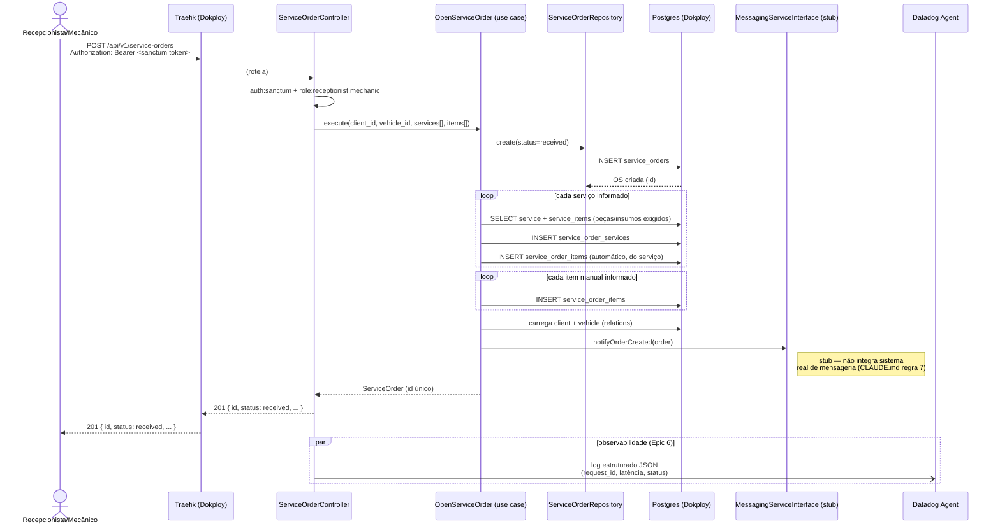

# Diagrama de sequência — abertura de Ordem de Serviço (Fase 3)

Mesmo fluxo de negócio da Fase 1/2
(`App\Application\ServiceOrder\OpenServiceOrder`), agora atravessando o
Gateway da Fase 3. Autenticação de quem abre a OS (recepcionista/mecânico)
continua Sanctum — não é uma rota do fluxo de CPF do cliente (ver
[sequence-auth.md](sequence-auth.md)).

Notas:
- `client_id` referencia um `User` com `role=client` — o mesmo registro que
  o fluxo de CPF ([sequence-auth.md](sequence-auth.md)) autentica; abrir a
  OS não exige que o cliente esteja logado, só que o recepcionista/mecânico
  informe o `client_id` correto.
- `notifyOrderCreated` é um stub (`StubMessagingService`) — nunca chama um
  serviço de mensageria real, convenção já estabelecida na Fase 1/2.
- O log estruturado (linha pontilhada pro Datadog Agent) é o Epic 6 —
  incluído aqui porque `evolucao_fase3` pede correlação entre requisições
  nos logs, e este é exatamente o tipo de operação que deve aparecer
  correlacionada.
